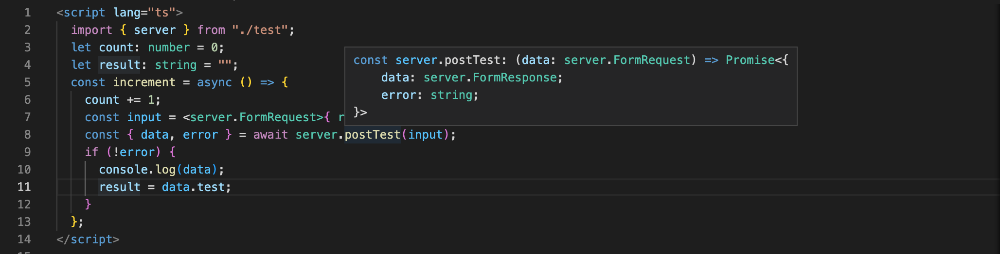

# ts-rpc

#### typescript RPC

---

##### The ghost bridge from front-end to backend

This project is a POC - Proof of concept.
The goal is to generate typescript code from golang using AST.
So you can use intellisense in the development IDE.

## 

```sh
git clone git@github.com:millevolte/ts-rpc-demo.git
cd ts-rpc-demo
go get ./...

go run main.go
```

now server is running
in the folder GeneratedCode you will find the file generatedTypescript.ts

Svelte front-end example

```
git clone https://github.com/millevolte/ts-rpc-svelte
cd ts-rpc-svelte
yarn

if you modify ts-rpc-demo
copy generatedTypescript.ts

yarn dev
```

open both project on VisualStudioCode and coding... test and coding...

Happy coding!
